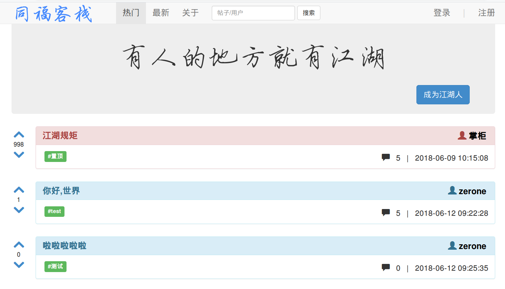
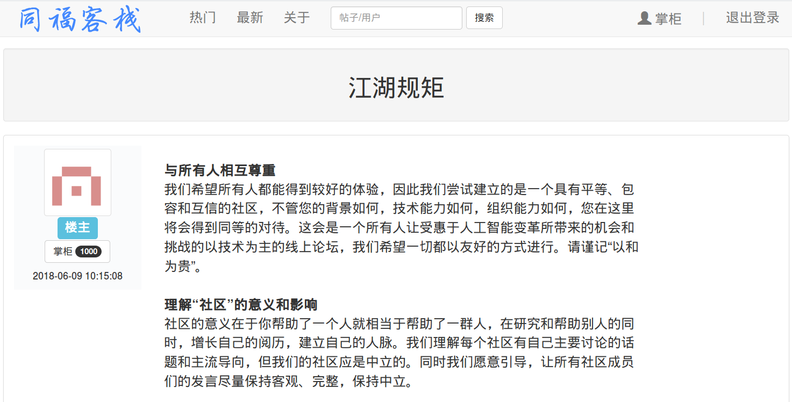
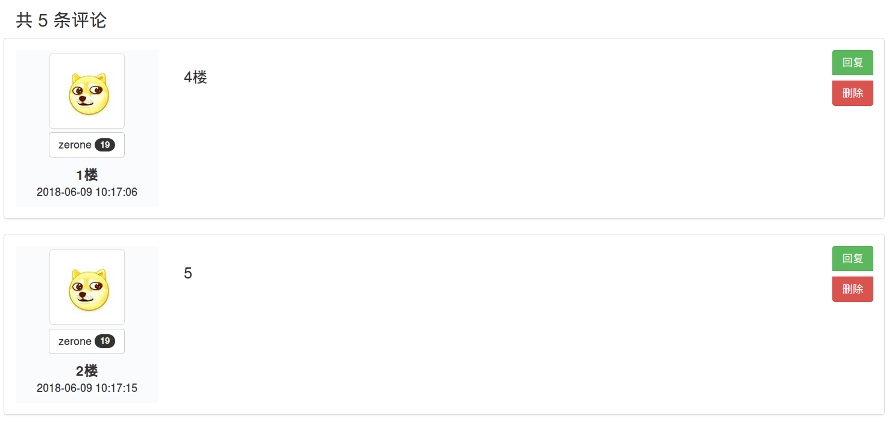
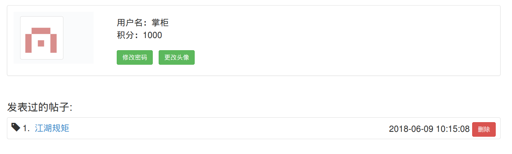
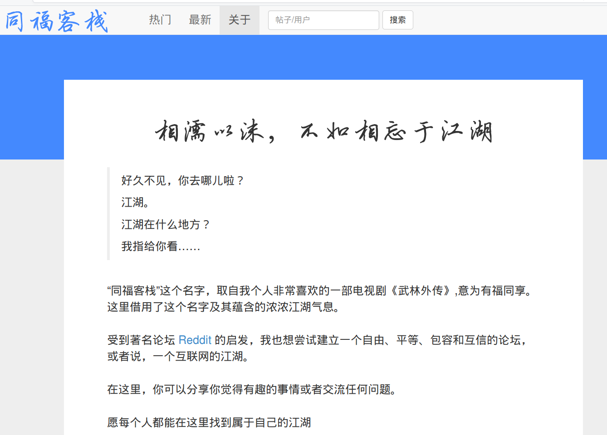
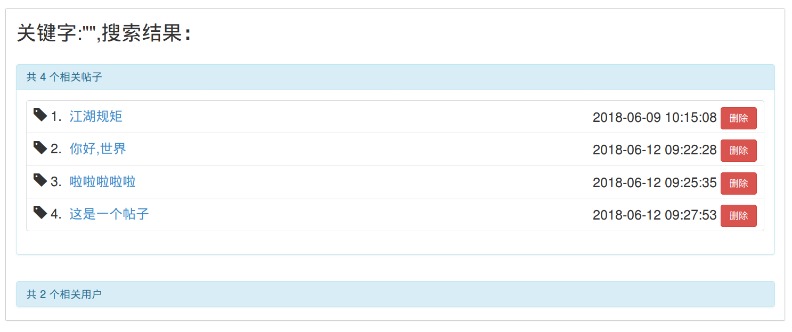
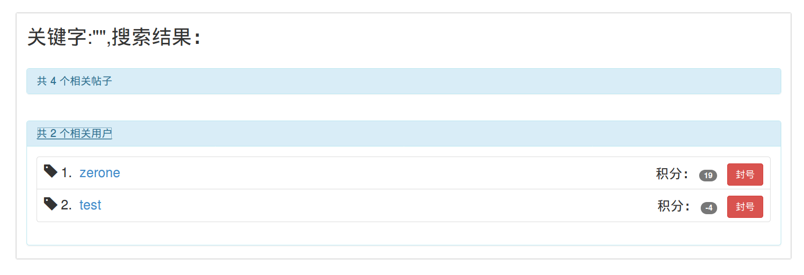
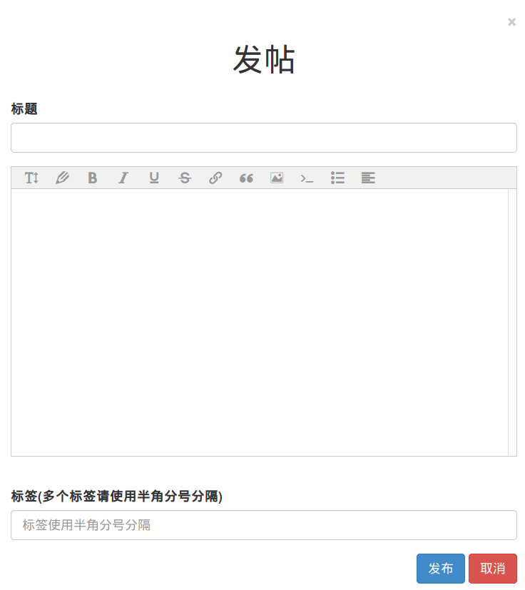

# Tongfu-Inn-Forum 同福客栈论坛

## 技术栈

+ 前端：HTML 5 + CSS 3 + JavaScript + Bootstrap 3 + jQuery
+ 后端：Java + Struts 2 + Hibernate + Maven
+ 数据库：MySQL

## 功能
+ 帖子管理：浏览帖子、发表帖子、删除帖子、搜索帖子、点赞/点踩帖子
+ 评论管理：浏览评论、发表评论、删除评论
+ 用户管理：查询用户、登录、注册、更改密码、更改头像、封禁账号、解禁账号、退出登录
+ 其他功能：返回顶部、加载更多、登录验证码、富文本编辑器、响应式页面、局部刷新、随机头像

## 截图
### 主界面

### 帖子详情页

### 个人中心页面

### 关于页面

### 搜索结果页面

### 发帖模态框

### 404页面

## 体验地址

http://103.100.236.244/page)

## TODO List

- [ ] 使用Spring Boot 重构项目
- [ ] 增加消息通知功能
- [ ] 增加忘记密码功能
- [ ] 增加必要个人信息，如邮箱、性别、生日等
